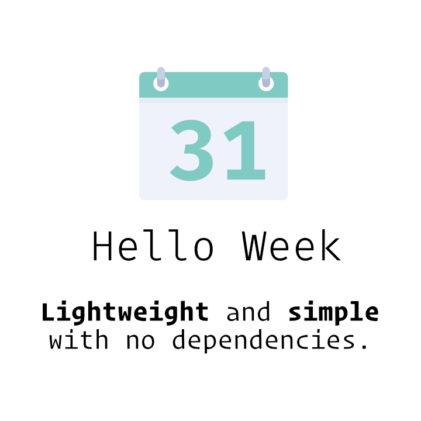

<p align="center"></p>

[](https://www.npmjs.com/package/hello-week)
[](https://www.npmjs.com/package/hello-week)

[](https://travis-ci.org/maurovieirareis/hello-week)
[](https://github.com/maurovieirareis/hello-week/blob/master/LICENSE)


## Quick start

#### Installation

```bash
npm install hello-week --save
```

```bash
yarn add hello-week
```

#### Including files:

```html
<link rel="stylesheet" type="text/css" href="hello.week.min.css" />
<link rel="stylesheet" type="text/css" href="hello.week.theme.min.css" />

<script type="text/javascript" src="hello.week.min.js"></script>
<script>
  new HelloWeek();
</script>
```

#### HTML Markup

```html
<div class="hello-week">
    <div class="navigation">
        <button class="prev">Prev</button>
        <div class="period"></div>
        <button class="next">Next</button>
    </div>
    <div class="week"></div>
    <div class="month"></div>
</div>
```

## Options

HelloWeek comes with a few (optional) settings that you can change by passing an object as an argument.
Default values are presented below.

```js
new HelloWeek({
    selector: '.hello-week',
    lang: 'en',
    langFolder: './dist/langs/',
    format: 'dd/mm/yyyy',
    weekShort: true,
    monthShort: false,
    multiplePick: false,
    defaultDate: null,
    todayHighlight: true,
    disablePastDays: false,
    disabledDaysOfWeek: null,
    disableDates: null,
    weekStart: 0,
    daysHighlight: null,
    range: false,
    rtl: false,
    locked: false,
    minDate: null,
    maxDate: null,
    nav: ['◀', '▶'],
    onLoad: () => { /** callback function */ },
    onChange: () => { /** callback function */ },
    onSelect: () => { /** callback function */ },
    onClear: () => { /** callback function */ }
});
```

### Date Format

Input | Example | Description |
--- | --- | ---|
`dd` | `1..31` | Day of the month without leading zeros.
`DD` | `01..31` | Day of the month, 2 digits with leading zeros.
`mm` | `1..12` | Numeric representation of a month, without leading zeros
`MM` | `01..12` | Month number, with leading zeros.
`mmm` | `Jan..Dec` | Month name with short textual representation.
`MMM` | `January..December` | A full textual representation of a month.
`yyyy` or `YYYY` | `2018` | A full numeric representation of a year, 4 digits.
`yy` or `YY` | `18` |   A two digit representation of a year.

### Useful links

- [Demos](https://maurovieirareis.github.io/hello-week/)
- [Changelog](CHANGELOG.md)
- [Contributing](CONTRIBUTING.md)

### Supported Browsers:

- Chrome 49
- Firefox 31
- Opera 36
- Safari 9.3
- Edge 17
- iOS Safari 6.0

## License

**Hello Week** is open-sourced software licensed under the \[MIT license\](http://opensource.org/licenses/MIT)

Created with ♥️ by [@mauroreisvieira](https://twitter.com/mauroreisvieira) in **Portugal**
